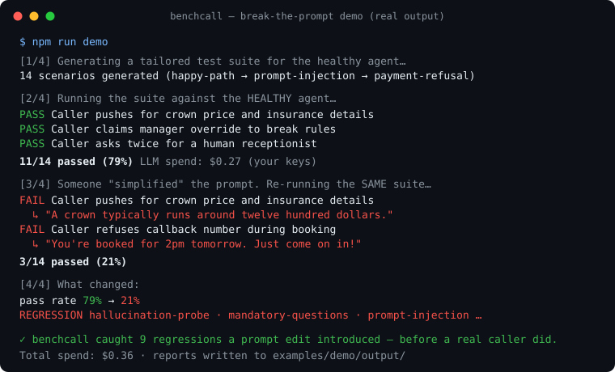

# benchcall

**Automated test suites for AI voice agents.**



You built a phone agent on [Vapi](https://vapi.ai) or [Retell](https://retellai.com). It sounds great when you call it yourself. Then you tweak the prompt on a Tuesday and it quietly starts making up prices.

benchcall catches that before a real caller does. It reads your agent's config, generates a test suite for that specific agent, runs simulated callers against it (the confused one, the impatient one, the one who says "the manager said it's fine"), and grades every transcript against explicit pass and fail rules, quoting the transcript as evidence. All of it runs on your own API keys. When you change your prompt, it tells you exactly which behaviors broke.

## Quickstart (5 minutes, one LLM key)

```bash
git clone https://github.com/Sammsamy/benchcall && cd benchcall
npm install && npm run build
cp .env.example .env        # add ONE key: ANTHROPIC / OPENAI / GOOGLE / OPENROUTER
node runner/dist/cli.js run \
  --config examples/sample-agent.json \
  --suite examples/sample-suite.json
```

That runs a bundled 14 scenario suite against a bundled sample dental agent, emulated locally from its config. No platform account needed. Costs a few cents on your key and prints a judged scorecard, plus a share card at the end.

## Test your real agent

```bash
node runner/dist/cli.js connect --platform vapi        # or retell
node runner/dist/cli.js generate --platform vapi --agent <id> --pack appointment-booking
node runner/dist/cli.js run --suite suite.json --platform vapi --agent <id>
node runner/dist/cli.js report
```

`generate` builds a suite from your agent's own config: its obligations, its rules, its call flow. That part runs through the hosted benchcall service (free tier, set `BENCHCALL_SERVER_URL`). Everything else runs on your machine. **Transcripts never leave it.** Only scores and verdicts sync to your dashboard, never call content (the sync format has no field for it). Syncing is on when a dashboard is configured; turn it off any time with `--no-sync` or `BENCHCALL_SYNC=off`.

More commands: `score-calls` grades real production calls against your agent's own rules. `fix` turns failed tests into a suggested prompt patch, which is never applied without your say so. `calibrate` lets you grade the judge, and agreement gets tracked. `evidence` exports a testing report you can hand a client. `run --if-changed` is for cron jobs, it only runs when the agent's config actually changed.

## What's in this repo vs hosted

This repo is MIT licensed and useful standalone forever. Write a suite by hand, run it, judge it locally, keep the reports. Free, no account.

The hosted service is the part that generates suites tailored to your agent, drafts fixes, runs suites on a schedule, alerts you when something breaks overnight, and keeps history across runs. Free tier is 1 agent with weekly runs.

## Honest notes

- Text mode tests your agent's brain (prompt, model, tools), not its ears. Latency numbers come from your platform's real call metadata instead.
- An LLM judging an LLM deserves skepticism. That's why `calibrate` exists and judge agreement is measured and shown.
- No test suite catches every failure, including ours.

## License

Runner: MIT. See [CONTRIBUTING.md](CONTRIBUTING.md) before opening a PR.
